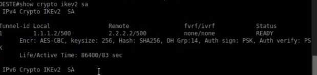
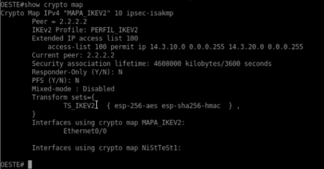
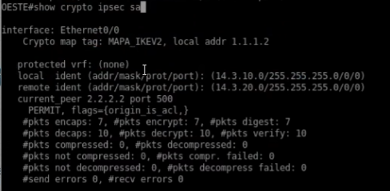
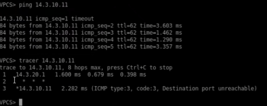

<h1>Instituto Tecnológico de Las Américas (ITLA)</h1>
  
<h2>Configuración y Verificación de VPN Site-to-Site Basada en Políticas (IPSec IKEv2)</h2>

Documentación Técnica Profesional — Práctica 5 (Semana 6)

   

<strong>Estudiante:</strong> Alan Daniel Garcia Mendez 
<strong>Matrícula:</strong> 2025-1403 
<strong>Carrera:</strong> Seguridad Informática 
<strong>Asignatura:</strong> Seguridad de Redes 
<strong>Docente:</strong> Jonathan Esteban Rondon Corniel 
<strong>Fecha de Entrega:</strong> 2 de julio de 2026 
<strong>Video de Exposición:</strong> <a href="https://youtu.be/uqhqnsVqVLY">https://youtu.be/uqhqnsVqVLY</a>

## Objetivo de la VPN
Implementar un túnel de comunicación segura Site-to-Site basado en políticas utilizando la versión moderna del protocolo IKEv2 para la negociación de claves. Este esquema interconecta de forma cifrada las LANs de Oeste y Este a través de internet (simulado por el ISP). IKEv2 ofrece mejoras críticas respecto a IKEv1, como mayor robustez frente a ataques de denegación de servicio (mediante cookies de autenticación), menor intercambio de mensajes de negociación de Fase 1 (reducción de 9 a 4 mensajes), soporte nativo de NAT Traversal, y mecanismos integrados de Keepalive que garantizan mayor confiabilidad en el mantenimiento del túnel.

## Topología de Red y Direccionamiento
La topología física mantiene la configuración física consistente con las anteriores de tránsito Site-to-Site.

  
  
Topología física Site-to-Site utilizada en la práctica

El direccionamiento IP asignado para este escenario se detalla a continuación:

| Dispositivo / Rol | Interfaz | Dirección IP / Subred | Descripción |
| :--- | :--- | :--- | :--- |
| **Router OESTE (Peer 1)** | Ethernet0/0 | `1.1.1.2/30` | WAN física hacia ISP |
| | Ethernet0/1 | `14.3.10.1/24` | LAN interna corporativa |
| | Tunnel0 | `10.0.0.1/30` | Interfaz lógica Tunnel VTI |
| **Router ESTE (Peer 2)** | Ethernet0/0 | `2.2.2.2/30` | WAN física hacia ISP |
| | Ethernet0/1 | `14.3.20.1/24` | LAN interna corporativa |
| | Tunnel0 | `10.0.0.2/30` | Interfaz lógica Tunnel VTI |

## Parámetros Criptográficos Utilizados
La negociación de claves y cifrado se ejecuta mediante los siguientes parámetros basados en IKEv2:

| Fase | Parámetro | Valor Configurado |
| :--- | :--- | :--- |
| **Fase 1 (IKEv2)** | Protocolo | IKEv2 Proposal (`PROP_IKEV2`) |
| **Fase 1** | Algoritmo de Cifrado | AES-CBC-256 |
| **Fase 1** | Función de Integridad | SHA-256 |
| **Fase 1** | Intercambio de Claves | Group 14 (Diffie-Hellman 2048-bit) |
| **Fase 1** | Llavero (Keyring) | `KEYRING_LOCAL` con pre-shared-key `CISCO123` |
| **Fase 1** | Perfil IKEv2 | `PERFIL_IKEV2` con autenticación pre-share local/remota |
| **Fase 2 (IPSec)** | Transform-Set | `TS_IKEV2` (`esp-aes 256 esp-sha256-hmac`) |
| **Fase 2** | Modo de Operación | Tunnel Mode (`mode tunnel`) |
| **Fase 2** | Tráfico Interesante | ACL 100 (LAN-Oeste ↔ LAN-Este) |

## Explicación de la Configuración y Scripts
La arquitectura IKEv2 en Cisco IOS separa explícitamente las políticas, llaveros y perfiles criptográficos. Se define una propuesta criptográfica (`crypto ikev2 proposal PROP_IKEV2`) y una política (`crypto ikev2 policy POL_IKEV2`). Las claves compartidas se asocian al llavero (`crypto ikev2 keyring KEYRING_LOCAL`) con la IP del peer correspondiente. Luego, el perfil (`crypto ikev2 profile PERFIL_IKEV2`) valida las identidades públicas y llama al llavero. Finalmente, el crypto map asocia el transform-set, la ACL 100 de tráfico interesante y el perfil de IKEv2.

El archivo con todos los comandos aplicados está en la carpeta de recursos de este entregable: [script_configuracion.txt](resources/script_configuracion.txt).

## Verificación de Funcionamiento

### 1. Estado de la Negociación IKEv2 SA (Fase 1)
Para verificar que el canal seguro de control bajo IKEv2 se ha negociado exitosamente, se ejecuta el comando `show crypto ikev2 sa` en el router `OESTE`. La salida registra una asociación activa establecida hacia el peer público remoto `2.2.2.2` desde la dirección local `1.1.1.2`. 

La SA está en el estado estable **`READY`**, y reporta los algoritmos configurados: **`Encr: AES-CBC, keysize: 256, Hash: SHA256, DH Grp:14, Auth sign/verify: PSK`**.

  
  
Estado IKEv2 SA en el router OESTE confirmando la sesión de control segura y activa

### 2. Estructura del Crypto Map e Interfaz WAN Protegida
La estructura del crypto map se verifica mediante el comando `show crypto map` en el router `OESTE`. La salida confirma que el crypto map `MAPA_IKEV2` con secuencia 10 se encuentra configurado para encapsular el tráfico de la lista de acceso 100 (`permit ip 14.3.10.0 0.0.0.255 14.3.20.0 0.0.0.255`) hacia el peer `2.2.2.2` utilizando el transform-set `TS_IKEV2` y el perfil `PERFIL_IKEV2`. Además, se indica que la interfaz física de salida asignada es **`Ethernet0/0`**.

  
  
Salida de show crypto map confirmando la asociación del perfil IKEv2 y la interfaz Ethernet0/0

### 3. Asociación de Seguridad IPSec Basada en Políticas (Fase 2)
Al ejecutar el comando `show crypto ipsec sa` en el router `OESTE`, se verifica el estado criptográfico de la interfaz física `Ethernet0/0` protegida por el crypto map `MAPA_IKEV2`. Las identidades protegidas se limitan estrictamente a las subredes LAN origen y destino:
* `local ident: (14.3.10.0/255.255.255.0/0/0)`
* `remote ident: (14.3.20.0/255.255.255.0/0/0)`

Los contadores de tráfico confirman el encriptado y desencriptado correcto de datos:
* **`#pkts encaps: 7`** y **`#pkts encrypt: 7`**
* **`#pkts decaps: 10`** y **`#pkts decrypt: 10`**

Esto comprueba que 7 paquetes salientes y 10 paquetes entrantes fueron procesados exitosamente por IPSec.

  
  
Detalles de la SA IPSec de Ethernet0/0 en OESTE protegiendo las subredes LAN específicas

### 4. Prueba de Conectividad y Trazado de Ruta LAN a LAN (Traceroute de Políticas)
La validación del canal seguro se realiza en el cliente VPCS ubicado en la LAN de Oeste. Al enviar pings hacia el host remoto en la LAN Este (`14.3.10.11`), se obtiene una conectividad exitosa con **0% de pérdida**.

Además, al trazar la ruta mediante el comando `tracer 14.3.10.11`, se comprueba el flujo de políticas de seguridad:
1. El primer salto se dirige al gateway de la LAN local `14.3.20.1` (interfaz del router Oeste).
2. El segundo salto transita a través de la red del ISP intermedio, la cual se reporta enmascarada con asteriscos (**`* * *`**), ya que al tratarse de una VPN basada en políticas, no existe interfaz virtual de enrutamiento punto a punto y el ISP no puede inspeccionar el encabezado original cifrado.
3. El tercer salto alcanza al host de destino `14.3.10.11`.

  
  
Prueba de conectividad desde VPCS confirmando el paso por el túnel basado en políticas de IKEv2

